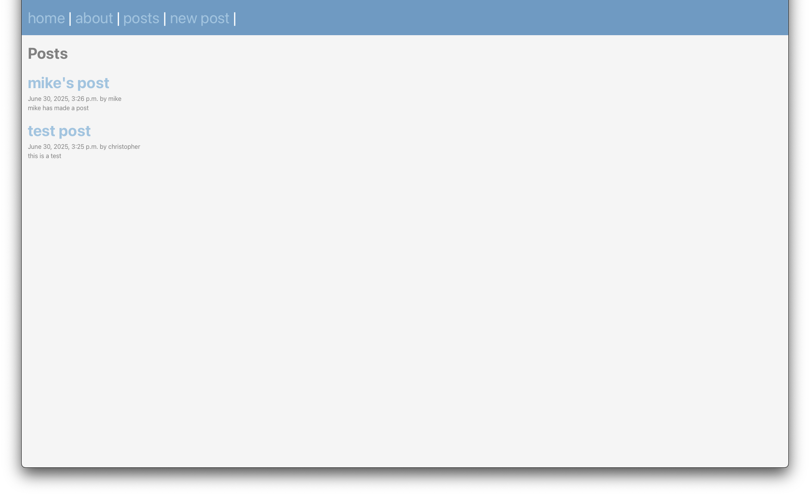

# Blogging App

## Descripton
A blogging app done in django that allows user registration and and the ability for users to post.
This application makes use of many django built-in "batteries" such as the ORM, templating, and authentication.
This project can be used as a reminder and template for many future projects to demonstrate many of the powerful features available for use.

## What I Learned
- Django ORM
- Templates
- Authentication
